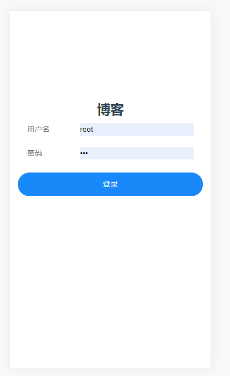

# 移动端博客项目简单模板
 主要供学习vue3新语法，练习node使用。
 
## 技术
- 前端技术栈：vue3 + vant + vue-router4 + vuex4
- 后端技术栈：node + express + mysql


## 部分页面展示



## 快速开始

### 前端服务启动
```
npm run serve
```
### 后端服务启动
进入到server目录下

```
npm run start:server
```
### 打包
```
npm run build
```


